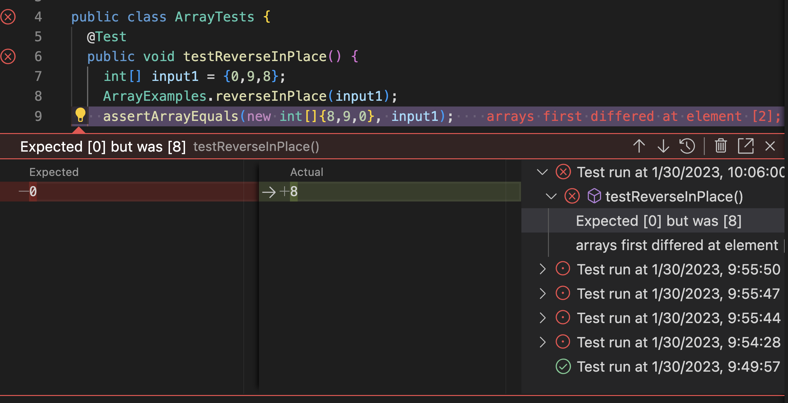

# PART 1 
### Input
I used the following code to create a web server called StringServer. 
```Java
import java.io.IOException;
import java.net.URI;

class Handler implements URLHandler {
    String str= new String();
public String handleRequest(URI url) {
        if (url.getPath().equals("/")) {
            return String.format("undefined");
        } else {
            System.out.println("Path:" + url.getPath());
            if (url.getPath().contains("/add-message")) {
                String[] parameters = url.getQuery().split("=");
                if (parameters[0].equals("s")) {
                    str += parameters[1] + "\n";
                    return String.format(str);
                }
            }
        return "404 Not Found!";
        }
    }
}

class StringServer {
    public static void main(String[] args) throws IOException {
        if(args.length == 0){
            System.out.println("Missing port number! Try any number between 1024 to 49151");
            return;
        }

        int port = Integer.parseInt(args[0]);

        Server.start(port, new Handler());
    }
}
```
### Output
I first entered the text "first try" 

then I entered "second try" 

and then " third try" 


All of them get concated into the string and appear one below the other due to the added new line character.<br>

We run StringServer.java, that invokes the main method. Where the server object passes the port number and handler Object as arguments. 
The server uses the method handleRequests in class Handler which handles all the URIs. <br>
The URI and the String "str" used changes its values.

# PART 2 
 ### A failure-inducing input for the buggy program.
 ```Java
 \public class ArrayTests {
	@Test 
	public void testReverseInPlace() {
    int[] input1 = {0,9,8};
    ArrayExamples.reverseInPlace(input1);
    assertArrayEquals(new int[]{8,9,0}, input1);
	}
  ```


### An input that doesn’t induce a failure
```Java
public class ArrayTests {
	@Test 
	public void testReverseInPlace() {
    int[] input1 = {0,0,0};
    ArrayExamples.reverseInPlace(input1);
    assertArrayEquals(new int[]{0,0,0}, input1);
	}
```


### The symptom, as the output of running the tests 



### The bug, as the before-and-after code change required to fix it

#### BEFORE
```Java
public class ArrayExamples {


  static void reverseInPlace(int[] arr) {
    for(int i = 0; i < arr.length; i += 1) {
      arr[i] = arr[arr.length - i - 1];
    }
  }
  ```
  #### AFTER
 ```Java
public class ArrayExamples {


  static void reverseInPlace(int[] arr) {
    for(int i = 0; i < arr.length/2; i += 1) {
      arr[i] = arr[arr.length - i - 1];
      int alt = arr[i];
     arr[arr.length - i - 1] = alt;
    }
  }
 ```
 
 The bug is fixed since we create a new variable called, alt which stores the array. Before doing so, the array would overwrite at specific indices. Such as, the array (0,9,8) should be reversed to (8,9,0) but it results in (8,9,8).
 
 
 # PART 3 
 
 Through Week 2 I learned to use Github to create my own repositories, I leaned to log in a remote server and access files created by other users. I also got create my own search engine. In week 3, I got familiarised with JUnit that I had not used previously. I also learned and understood the concept of bugs, and symptoms better.
 


