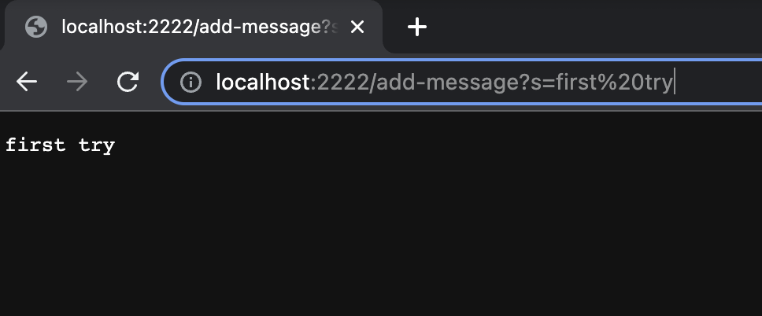
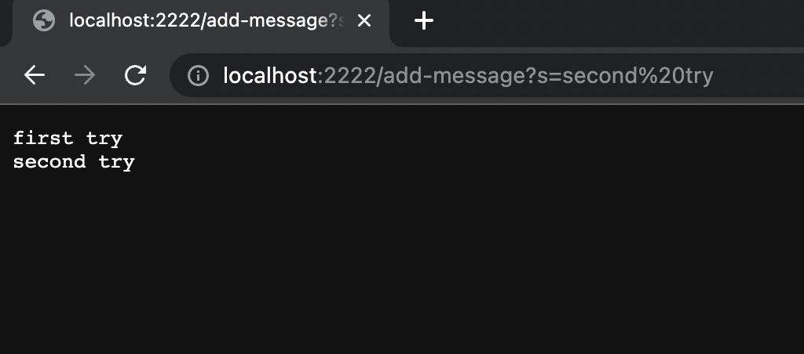
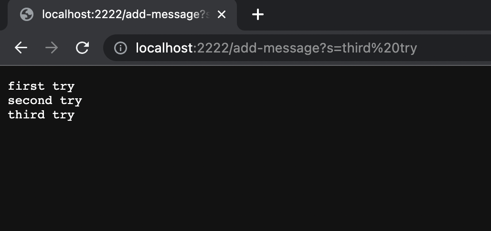

# PART 1 
###Input
I used the following code, 
```Java
import java.io.IOException;
import java.net.URI;

class Handler implements URLHandler {
    String str= new String();
public String handleRequest(URI url) {
        if (url.getPath().equals("/")) {
            return String.format("undefined");
        } else {
            System.out.println("Path:" + url.getPath());
            if (url.getPath().contains("/add-message")) {
                String[] parameters = url.getQuery().split("=");
                if (parameters[0].equals("s")) {
                    str += parameters[1] + "\n";
                    return String.format(str);
                }
            }
        return "404 Not Found!";
        }
    }
}

class StringServer {
    public static void main(String[] args) throws IOException {
        if(args.length == 0){
            System.out.println("Missing port number! Try any number between 1024 to 49151");
            return;
        }

        int port = Integer.parseInt(args[0]);

        Server.start(port, new Handler());
    }
}
```
###Output
I first entered the text "first try" 

then I entered " second try" 

and then " third try" 


#PART2


